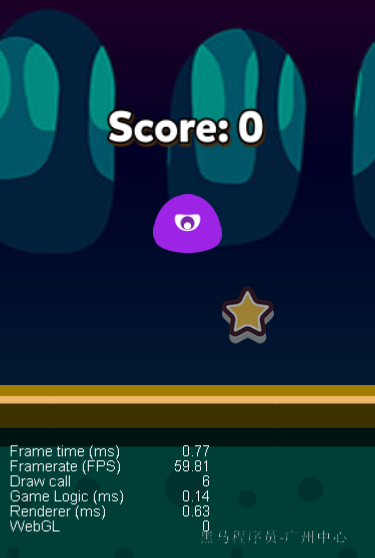

#   `5G时代-探索微信小游戏`

> 传智播客-黑马程序员-广州校区

##   微信小游戏

小游戏目前已经超过2000款游戏接入，用户数超过3.1亿，多款产品超过千万DAU级别。目前小游戏支持道具内购以及流量广告的两种收入方式

> 其他关键字 腾讯公益游戏

###   在线 案例展示

####   星途

星途小游戏累计注册用户超过1亿，最高DAU接近800万，最高次留超过45%广告收入数据持续走高，成为微信小游戏主要标杆产品。

####   腾讯桌球

腾讯桌球小游戏是一款模拟现实桌球的手机休闲竞技游戏。游戏上线50天最高达到日活520万，约为App日活的8倍。道具内购+广告收入月流水突破千万。带动同名App游戏新进增长，活跃及收入同比提升30%

###   课堂案例展示

####   案例一

> 手绘飞机大战

####   案例二

> 飞机大战

####   案例三

> 抓星星

###   学习路线 ！！！

本次课程将开发之路一分为三：

####   纯可视化工具开发

---

####   纯代码开发

---

####   可视化工具 + 代码

###   学习帮助

####   JavaScript

1. [帮助手册](https://www.w3school.com.cn/js/index.asp)

2. [入门视频](http://yun.itheima.com/course/c135/p/1.html?jingjiahmpz-pz-pc-biaoti)

  

3. 电子书

   

####   canvas

1. [canvas手册](https://www.w3school.com.cn/tags/tag_canvas.asp)
2. 

####   面向对象

1. [面向对象视频](http://yun.itheima.com/course/561.html?jingjiahmpz-pz-pc-biaoti)
2. 

####   微信小程序

1. [微信小程序](https://search.bilibili.com/all?keyword=微信小程序%20黑马程序员&from_source=nav_search&spm_id_from=333.851.b_696e7465726e6174696f6e616c486561646572.12)
2. 

####   微信小游戏

1. [微信小游戏](https://developers.weixin.qq.com/minigame/dev/guide/)

2. [微信小游戏可视化工具](https://gamemaker.weixin.qq.com/#/)

3. [cocos creator](http://docs.cocos.com/creator/manual/zh/getting-started/)

##   [案例一](./mini-program-game01.md)

##   [案例二](./mini-program-game02.md)

##   [案例三](./mini-program-game03.md)

##  总结

1. 微信有一个自己的微信小游戏的可视化工具（1.0.0版本）
2. 想通过代码来开发游戏
   1. JavaScript
   2. canvas
   3. 面向对象
3. 掌握可视化工具（cc 白鹭）
4. 前端 不止于 vue 微信小程序 react。。。
   1. node 后台 
   2. 小游戏 ！！！
5. 混合app
   1. rn react native
   2. uni-app vue语法
   3. taro react 语法 