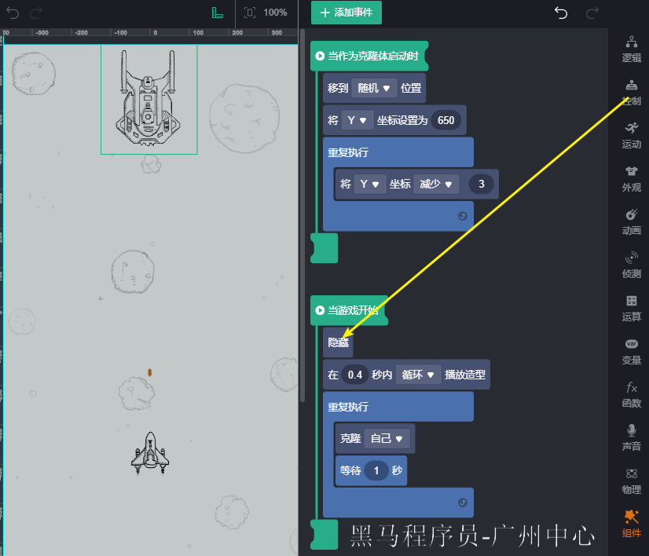
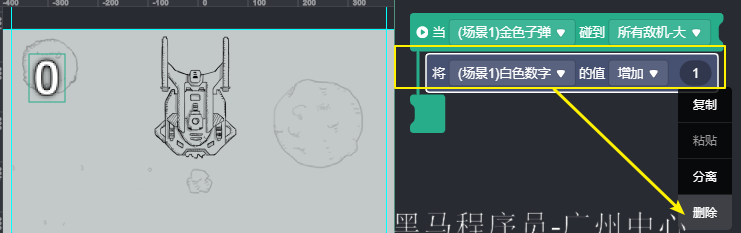

#   案例一 像素飞机

[官网](https://developers.weixin.qq.com/minigame/introduction/gamemaker/brief.html)

##   可视化工具

##   添加素材

##   选择 `飞机大战`

##   让 背景移动

##   添加 `战机`

##   设置 `战机` 随手指移动

##   添加 `子弹`

##   克隆 `子弹`

##  0. 让 `被克隆的子弹` 发射出去

##   隐藏 `子弹本体`

##   添加 `敌机`

##   克隆 `敌机`

##   让 `敌机的克隆体` 在水平方向随机出现，再往下飞

##   隐藏 `敌机本体`

##   添加 `子弹  ` 和 `敌机` 的碰撞效果

###   为 `敌机` 添加 `爆炸` 造型

###   为 `敌机` 添加碰撞 `子弹` 检测 、 切换 成 `爆炸`造型、和 销毁 `敌机`

##   给 `发射子弹` 添加 `声音`

##   添加 `分数`

##   添加 `战机` 和 `敌机` 碰撞

1. 添加碰撞事件
2. 将战机切换为爆炸造型
3. 延迟一会 
4. 弹出对话框
5. 停止游戏

##  0. 将 `分数` 上传到 `排行榜`

###  0.1. 把 `白色数字`中的 `增加数量` 功能移除掉

> 因为我们需要将分数缓存下来，需要用到 `变量`和 `函数`功能

###  0.2. 添加变量 `杀敌数量`

###  0.3. 添加函数 `计算杀毒数量`

###  0.4. 在函数内 将 `杀敌数量 `   叠加 1

###  0.5. 将 `分数` 换算成 `杀敌数量`

###  0.6. 在 `白色数字` 的碰撞事件中 `调用函数`

###  0.7. 当 `战机`  碰撞到 `敌机`后，`上传分数到排行榜` 和 `打开 排行榜`

