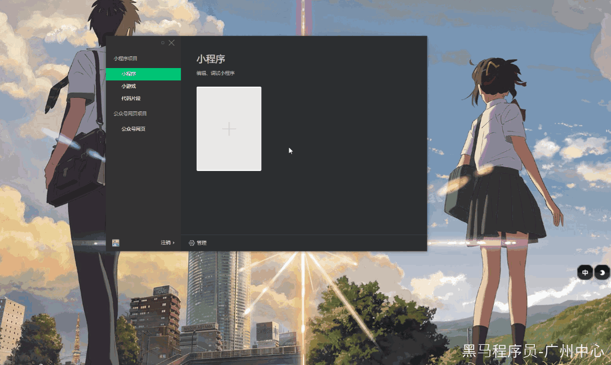
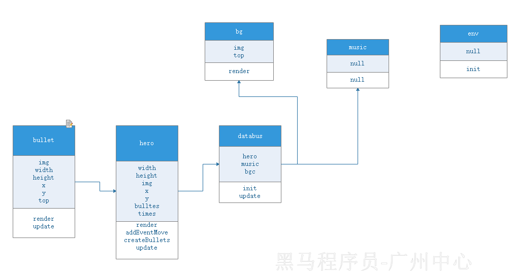

#   案例二 飞机大战

> 本案例主要使用 微信开发者工具内置的 `小游戏` 来开发

##   新建项目

> 要选择 `微信小程序`



##   精简代码

1. 删除 `js` 文件夹
2. 清空 `game.js`的代码


##   核心概念

###   [canvas](https://developer.mozilla.org/zh-CN/docs/Web/API/Canvas_API)

提供了一个通过[JavaScript](https://developer.mozilla.org/zh-CN/docs/Web/JavaScript) 和 [HTML](https://developer.mozilla.org/zh-CN/docs/Web/HTML)的[canvas](https://developer.mozilla.org/zh-CN/docs/Web/HTML/Element/canvas)元素来绘制图形的方式。它可以用于动画、游戏画面、数据可视化、图片编辑以及实时视频处理等方面。

###   [requestAnimationFrame](https://developer.mozilla.org/zh-CN/docs/Web/API/Window/requestAnimationFrame)

> setTimeout 等 会重复让浏览器执行 回流 和重绘 

告诉浏览器——你希望执行一个动画，并且要求浏览器在下次重绘之前调用指定的回调函数更新

> 1. 屏幕刷新频率：屏幕每秒出现图像的次数。普通笔记本为60Hz
> 2. 动画原理：计算机每16.7ms刷新一次，由于人眼的视觉停留，所以看起来是流畅的移动

```js
requestAnimationFrame(callback);
```

##   核心API

| 函数名                                                       | 作用                                                         |
| ------------------------------------------------------------ | ------------------------------------------------------------ |
| [wx.createCanvas()](https://developers.weixin.qq.com/miniprogram/dev/api/canvas/wx.createCanvasContext.html) | 创建 canvas 的绘图上下文 [CanvasContext](https://developers.weixin.qq.com/miniprogram/dev/api/canvas/CanvasContext.html) 对象 |
| [canvas.getContext('2d')](https://developers.weixin.qq.com/miniprogram/dev/api/canvas/Canvas.getContext.html) | 该方法返回 Canvas 的绘图上下文                               |
| [wx.createImage()](https://developers.weixin.qq.com/miniprogram/dev/api/canvas/Canvas.createImage.html) | 创建一个图片对象                                             |
| [CanvasContext.drawImage()](https://developers.weixin.qq.com/miniprogram/dev/api/canvas/CanvasContext.drawImage.html) | 绘制图像到画布                                               |
| [wx.createInnerAudioContext()](https://developers.weixin.qq.com/miniprogram/dev/api/media/audio/wx.createInnerAudioContext.html) | 创建内部 [audio](https://developers.weixin.qq.com/miniprogram/dev/component/audio.html) 上下文 [InnerAudioContext](https://developers.weixin.qq.com/miniprogram/dev/api/media/audio/InnerAudioContext.html) 对象 |
| [InnerAudioContext.src](https://developers.weixin.qq.com/miniprogram/dev/api/media/audio/InnerAudioContext.html) | 设置要播放的音频                                             |
| [InnerAudioContext.play()](https://developers.weixin.qq.com/miniprogram/dev/api/media/audio/InnerAudioContext.play.html) | 播放音频                                                     |
| [CanvasContext.clearRect()](https://developers.weixin.qq.com/miniprogram/dev/api/canvas/CanvasContext.clearRect.html) | 清除画布上在该矩形区域内的内容                               |


##   面向对象-编写游戏-高能预警

> 接下来使用 es6 + 面向对象对游戏代码进行简单的封装

###   搭建项目结构

在根目录下，新建 `js`  文件夹， 然后新建以下文件

```js
+ /base/env.js 存放全局变量（height）和 引入资源（如图片等）
+ /background/music.js 音乐
+ /background/bg.js 背景图
+ /play/player.js 英雄
+ /play/enemy.js 敌机
+ /play/bullet.js 子弹
+ /databus.js 全局的状态管理对象
```


###   整体的关系图




###   编写环境类

`js\base\env.js`

1. 在项目启动的时候先把需要用到的图片资源全部下载后，通过`promise`形势进行封装
2. 把下载好的图片对象都存入到全局的window.imgs对象中，方便获取

```js
window.canvas = wx.createCanvas()
window.ctx = canvas.getContext('2d');
window.width = wx.getSystemInfoSync().screenWidth;
window.height = wx.getSystemInfoSync().screenHeight;
window.imgs = [];
class env {
  init() {
    return new Promise((r, j) => {
      [
        "./images/bg.jpg",
        "./images/bullet.png",
        "./images/Common.png",
        "./images/enemy.png",
        "./images/explosion1.png",
        "./images/explosion10.png",
        "./images/explosion11.png",
        "./images/explosion12.png",
        "./images/explosion13.png",
        "./images/explosion14.png",
        "./images/explosion15.png",
        "./images/explosion16.png",
        "./images/explosion17.png",
        "./images/explosion18.png",
        "./images/explosion19.png",
        "./images/explosion2.png",
        "./images/explosion3.png",
        "./images/explosion4.png",
        "./images/explosion5.png",
        "./images/explosion6.png",
        "./images/explosion7.png",
        "./images/explosion8.png",
        "./images/explosion9.png",
        "./images/hero.png"
      ]
        .forEach((v, i, arr) => {
          const img = wx.createImage();
          img.src = v;
          window.imgs[v.match(/(\w+)\.[jpg|png|gif|jpeg|webp]+/)[1]] = img;
          img.onload = () => {
            if (i === arr.length - 1) {
              r();
            }
          }
        })
    })
  }
}
export default env;
```

###   编写 背景图片类

1. 实现动态的显示图片

`js\background\bgc.js`

```js
class bg {
  constructor() {
    this.img = imgs["bg"];
    this.top = 0;
    this.render();
  }
  render() {
    ctx.drawImage(this.img, 0, this.top, width, height);
    ctx.drawImage(this.img, 0, -height + this.top, width, height);
  }
  update() {
    this.top++;
    if (this.top === height) {
      this.top = 0;
    }
    this.render();
  }
}
export default bg;
```

###   编写全局状态管理类

1. 负责控制其他类的状态
2. 引入背景图片类，然后实例化

`js\databus.js`

```js
import Bgc from "./background/bgc";
class databus {
  constructor() {
    this.bgc = null;
  }
  init() {
    this.bgc = new Bgc();
  }
  update() {
    this.bgc.update();
  }
}

export default databus
```

###   编写游戏入口文件

1. 负责引入环境类和全局状态管理类
2. 开始运行游戏

`game.js`

```js
import Env from "./js/base/env";
import Databus from "./js/databus";
const env = new Env();

main();
async function main() {
  await env.init();
  const databus = new Databus();
  databus.init();
  loop();
  function loop() {
    ctx.clearRect(0, 0, width, height);
    databus.update();
    requestAnimationFrame(loop);
  }
}

```

###   编写背景音乐类

1. 播放和控制背景音乐

`js\background\music.js`

```js
class music {
  constructor() {
    this.bgc = wx.createInnerAudioContext();
    this.bgc.src = "./audio/bgm.mp3";
    this.bgc.play();
  }
}

export default music;
```

然后修改全局状态管理类 `js\databus.js`

1. 引入和播放音乐

```js
import Bgc from "./background/bgc";
import Music from "./background/music"; // 新增代码
class databus {
  constructor() {
    this.bgc = null;
    this.music=null; // 新增代码
  }
  init() {
    this.bgc = new Bgc();
    this.music=new Music(); // 新增代码
  }
  update() {
    this.bgc.update();
  }
}

export default databus
```

###   新增英雄类

1. 实现动态渲染飞机

`js\play\hero.js`

```js
class hero {
  constructor() {
    this.width = 50;
    this.height = 50;
    this.img = imgs["hero"];
    this.x = (width - this.width) / 2;
    this.y = (height - this.height);
  }
  render() {
    ctx.drawImage(this.img, this.x, this.y, this.width, this.height);
  }
  update() {
    this.render();
  }
}
export default hero;
```

修改全局管理类 `js\databus.js`

1. 引入飞机

```js
import Bgc from "./background/bgc";
import Hero from "./play/hero";
import Music from "./background/music";
class databus {
  constructor() {
    this.hero = null;
    this.bgc = null;
    this.music=null;
  }
  init() {
    this.bgc = new Bgc();
    this.hero = new Hero();
    this.music=new Music();
  }

  update() {
    this.bgc.update();
    this.hero.update();
  }
}

export default databus
```


###   编写英雄跟随手指移动

1. 通过给canvas绑定手指移动事件

`js\play\hero.js`

```js
class hero {
  constructor() {
    this.width = 50;
    this.height = 50;
    this.img = imgs["hero"];
    this.x = (width - this.width) / 2;
    this.y = (height - this.height);
    this.addEventMove();
  }
  render() {
    ctx.drawImage(this.img, this.x, this.y, this.width, this.height);
  }
  addEventMove() {
    canvas.addEventListener("touchmove", (e) => {
      const { clientX, clientY } = e.changedTouches[0];
      this.x = clientX - this.width / 2;
      this.y = clientY - this.height / 2;
      this.render();
    })
  }
  update() {
    this.render();
  }
}
export default hero;
```

###  0. 新增子弹类

1. 让英雄可以发射子弹

`js\play\bullet.js`

```js
class bullet {
  constructor(x, y) {
    this.img = imgs["bullet"];
    this.width = 20;
    this.height = 20;
    this.x = x-this.width/2;
    this.y = y;
    this.top = 0;
    this.render();
  }
  render() {
    ctx.drawImage(this.img, this.x, this.y, this.width, this.height); 
  } 
  update() { 
    this.top++;
    this.y=this.y-this.top;
    this.render();
  }
}
export default bullet;
```

修改英雄类

`js\play\hero.js`

```js
import Bullet from "./bullet";
class hero {
  constructor() {
    this.width = 50;
    this.height = 50;
    this.img = imgs["hero"];
    this.x = (width - this.width) / 2;
    this.y = (height - this.height);
    this.bulltes = [];
    this.times = 0;
    this.render();
    this.addEventMove();
    this.createBullets();
  }
  render() {
    ctx.drawImage(this.img, this.x, this.y, this.width, this.height);
  }
  addEventMove() {
    canvas.addEventListener("touchmove", (e) => {
      const { clientX, clientY } = e.changedTouches[0];
      this.x = clientX - this.width / 2;
      this.y = clientY - this.height / 2;
      this.render();
    })
  }
  update() {
    this.render();
    this.createBullets();
    this.shoot();
    
  }
  createBullets() {
    this.times++;
    if (this.times % 30 === 0) {
      this.bulltes.push(new Bullet(this.x+this.width/2, this.y));
      this.times = 0;
    }
  }
  shoot() {
    this.bulltes.forEach(v=>{
      v.update();
    })
  }
}
export default hero;
```


##   git地址

> 后续可以更新

```js
https://github.com/itcastWsy/plane
```

