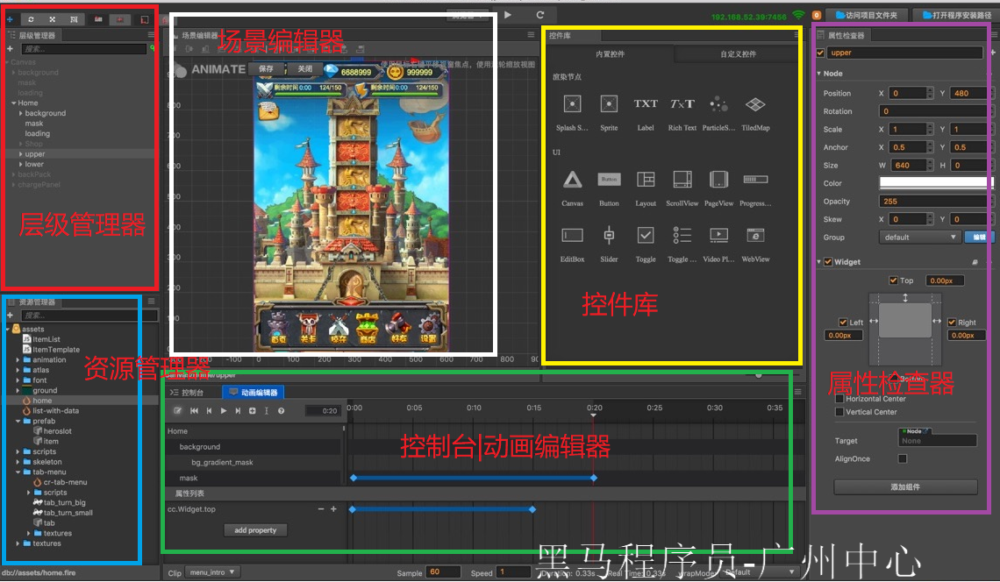

#   案例三 抓星星

本案例主要是通过图形化界面+代码来实现

[在线预览](http://fbdemos.leanapp.cn/star-catcher/)

##   cocos creator开发框架介绍

1. Cocos Creator 编辑器提供`面向设计`和`开发`的两种工作流
2. Cocos Creator 目前支持发布游戏到 `Web`、`iOS`、`Android`、各类"`小游戏`"、`PC 客户端`等平台
3. 使用`JavaScript`语言

##   环境准备

###   [工具下载](https://www.cocos.com/creator/)

可以选择 `window` 或者 `mac`版本进行下载

###   [注册账号](https://auth.cocos.com/#/sign_up/register?language=zh)

登录开发工具的时候需要账号

###   [工具界面](http://docs.cocos.com/creator/manual/zh/getting-started/basics/editor-overview.html)




##   开始项目

1. [下载完整资源包（用来比对自己的代码）](https://github.com/cocos-creator/tutorial-first-game/releases/download/v2.0/start_project.zip)
2. [下载基础资源包（可以在这个基础上进行开发，里面包含了基本的素材）](https://github.com/cocos-creator/tutorial-first-game/releases/download/v2.0/start_project.zip)

###   打开工具 导入 基础资源项目


---


###   将`背景图片`从`资源管理器`拖到`层级管理器中`

> 注意放在 `Canvas`层级下


###   使用工具调整背景图片的位置


###   将`地板图片`从`资源管理器`拖到`层级管理器中`


###   将`主人`也拖入


###   给`主人`添加`脚本`

> 只有添加了脚本，才个给主人赋予了生命

1. 在资源管理器中 新建文件夹 `script`

2. 在文件夹中，新建脚本 `Play`,不要加后缀名。自动添加的

   

   

###   设置 自己喜爱的编辑器做为 编辑脚本的工具

> 我习惯使用了vs code了


###   在 脚本 `Play`中添加 跳跃相关的属性

> Cocos Creator 规定一个节点具有的属性都需要写在 `properties` 代码块中

```js
cc.Class({
    extends: cc.Component,
    properties: {
        // 主角跳跃高度
        jumpHeight: 0,
        // 主角跳跃持续时间
        jumpDuration: 0,
        // 最大移动速度
        maxMoveSpeed: 0,
        // 加速度
        accel: 0,
    }
});

```

###   给 `层级管理器`中的 `主人` 添加 `脚本`

1. 单击  场景编辑器中的 `主人`
2. 在打开的 `属性检查器`最底部 点击 `添加组件`
3. 选择 `用户脚本组件`
4. 然后手动的添加 `属性值`


---


###  0. 添加`跳跃代码`让主人跳起来

修改 `Play`脚本

```js
cc.Class({
    extends: cc.Component,
    properties: {
        // 主角跳跃高度
        jumpHeight: 0,
        // 主角跳跃持续时间
        jumpDuration: 0,
        // 最大移动速度
        maxMoveSpeed: 0,
        // 加速度
        accel: 0,
    },
    // 设置跳跃的动作
    setJumpAction: function () {
        // 跳跃上升 cc.moveBy接收 参数1：跳跃的持续时间 参数2：向量  返回 时间间隔动作的类
        const jumpUp = cc.moveBy(this.jumpDuration, cc.v2(0, this.jumpHeight)).easing(cc.easeCubicActionOut());
        // 下落
        const jumpDown = cc.moveBy(this.jumpDuration, cc.v2(0, -this.jumpHeight)).easing(cc.easeCubicActionIn());
        // 不断重复
        return cc.repeatForever(cc.sequence(jumpUp, jumpDown));
    },

    // 场景加载完毕触发
    onLoad: function () {
        // 初始化跳跃动作
        this.jumpAction = this.setJumpAction();
        // 执行动作
        this.node.runAction(this.jumpAction);
    }
});

```

这个时候，点击 `运行`按钮，可以看到 `主人`已经跳跃起来了


###   添加键盘移动控制事件

通过键盘输入  `A` `D` 来控制 人物的移动

1. 给 `Play`新增以下 事件，`onKeyDown `和 `onKeyUp `
2. 在 `onLoad`中注册事件
3. 新增 `update` 方法，来控制移动


给 `Play`新增以下 事件，`onKeyDown `和 `onKeyUp `

```js
    setJumpAction: function () {
        //...
    },

    onKeyDown (event) {
        // set a flag when key pressed
        switch(event.keyCode) {
            case cc.macro.KEY.a:
                this.accLeft = true;
                break;
            case cc.macro.KEY.d:
                this.accRight = true;
                break;
        }
    },

    onKeyUp (event) {
        // unset a flag when key released
        switch(event.keyCode) {
            case cc.macro.KEY.a:
                this.accLeft = false;
                break;
            case cc.macro.KEY.d:
                this.accRight = false;
                break;
        }
    },
```

在 `onLoad`中注册事件

```js
    onLoad: function () {
        // 初始化跳跃动作
        this.jumpAction = this.setJumpAction();
        this.node.runAction(this.jumpAction);

        // 加速度方向开关
        this.accLeft = false;
        this.accRight = false;
        // 主角当前水平方向速度
        this.xSpeed = 0;

        // 初始化键盘输入监听
        cc.systemEvent.on(cc.SystemEvent.EventType.KEY_DOWN, this.onKeyDown, this);
        cc.systemEvent.on(cc.SystemEvent.EventType.KEY_UP, this.onKeyUp, this);   
    },

    onDestroy () {
        // 取消键盘输入监听
        cc.systemEvent.off(cc.SystemEvent.EventType.KEY_DOWN, this.onKeyDown, this);
        cc.systemEvent.off(cc.SystemEvent.EventType.KEY_UP, this.onKeyUp, this);
    },
```

新增 `update` 方法，来控制移动

`update` 在场景加载后就会每帧调用一次

```js
    update: function (dt) {
        // 根据当前加速度方向每帧更新速度
        if (this.accLeft) {
            this.xSpeed -= this.accel * dt;
        } else if (this.accRight) {
            this.xSpeed += this.accel * dt;
        }
        // 限制主角的速度不能超过最大值
        if ( Math.abs(this.xSpeed) > this.maxMoveSpeed ) {
            // if speed reach limit, use max speed with current direction
            this.xSpeed = this.maxMoveSpeed * this.xSpeed / Math.abs(this.xSpeed);
        }

        // 根据当前速度更新主角的位置
        this.node.x += this.xSpeed * dt;
    },
```


###   [未完待续。。。](http://docs.cocos.com/creator/manual/zh/getting-started/quick-start.html)

